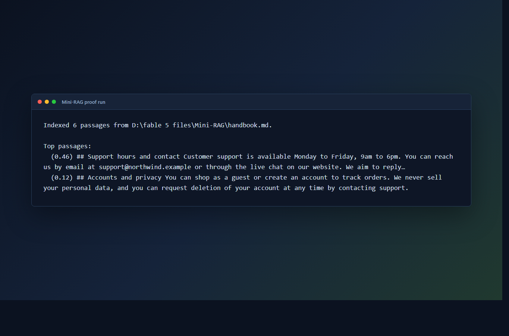

# Mini-RAG

A tiny **"chat with your document"** retriever in **pure Python** — zero dependencies. It
demonstrates the core **Retrieval-Augmented Generation** pattern: chunk a document, rank passages
against a question with **TF-IDF + cosine similarity**, and return the most relevant ones. With an
API key it also writes a grounded answer that **cites** the passages it used.



## Portfolio proof
- [Case study](PORTFOLIO-CASE-STUDY.md) — how this tiny implementation explains the RAG pattern without heavy tooling.
- GitHub Actions smoke check compiles the script and verifies a sample retrieval run on every push.

## Why it's interesting
RAG is usually shown with heavy stacks (vector DBs, embedding APIs, LangChain). This strips it to
the essentials so the *mechanism* is clear and it runs anywhere with just Python — no install, no
keys needed for retrieval.

## Usage
```bash
python mini_rag.py handbook.md "what is the return policy?"
python mini_rag.py handbook.md "do you ship overseas?" --k 2
python mini_rag.py handbook.md                      # interactive Q&A loop
python mini_rag.py handbook.md "how long is the warranty?" --ai   # grounded answer (needs ANTHROPIC_API_KEY)
```

## Example
```
$ python mini_rag.py handbook.md "when can I contact support?" --k 1
Indexed 6 passages from handbook.md.

Top passages:
  (0.46) ## Support hours and contact  Customer support is available Monday to Friday, 9am to 6pm...
```

## How it works
1. **Chunk** the document into passages (blank-line split, short chunks merged).
2. **Index** — build TF-IDF vectors (term frequency × inverse document frequency) per passage.
3. **Retrieve** — vectorize the question and rank passages by cosine similarity.
4. **(Optional) Answer** — with `--ai`, send the top passages + question to the Anthropic API
   (via `urllib`, no SDK) and get an answer constrained to cite the source passages — so it can't
   hallucinate beyond the document.

Pure standard library: `re`, `math`, `collections`, `urllib`. No `pip install`.

## Real-world version
For production you'd swap TF-IDF for embeddings + a vector store (e.g. pgvector/Chroma) — but the
retrieve → ground → cite loop is exactly this. Good base for an SMB "chat with your SOPs" tool.

## License
MIT © Rolly Calma ([Ghraven](https://github.com/Ghraven))
