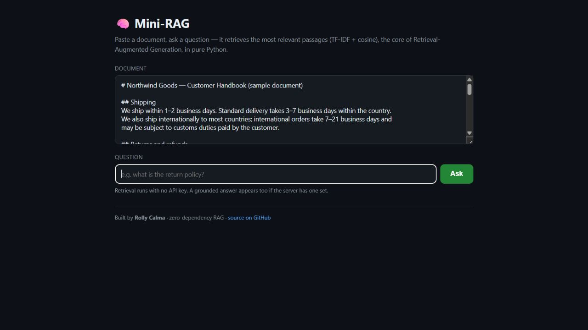

# Mini-RAG

A tiny **"chat with your document"** retriever in **pure Python** — zero dependencies. It
demonstrates the core **Retrieval-Augmented Generation** pattern: chunk a document, rank passages
against a question with **TF-IDF + cosine similarity**, and return the most relevant ones. With an
API key it also writes a grounded answer that **cites** the passages it used. The finance demo
adds an evidence-term guardrail so a question is not treated as grounded just because one generic
passage scored above the threshold.



## Portfolio proof
- [Live browser demo](https://mini-rag-ju6l.onrender.com/) — try the retrieval flow without cloning the repo.
- [Case study](PORTFOLIO-CASE-STUDY.md) — how this tiny implementation explains the RAG pattern without heavy tooling.
- GitHub Actions smoke check compiles the script and verifies a sample retrieval run on every push.

## Why it's interesting
RAG is usually shown with heavy stacks (vector DBs, embedding APIs, LangChain). This strips it to
the essentials so the *mechanism* is clear and it runs anywhere with just Python — no install, no
keys needed for retrieval.

## Usage
```bash
python mini_rag.py handbook.md "what is the return policy?"
python mini_rag.py handbook.md "do you ship overseas?" --k 2
python mini_rag.py handbook.md                      # interactive Q&A loop
python mini_rag.py handbook.md "how long is the warranty?" --ai   # grounded answer (needs ANTHROPIC_API_KEY)
```

## Example
```
$ python mini_rag.py handbook.md "when can I contact support?" --k 1
Indexed 6 passages from handbook.md.

Top passages:
  (0.46) ## Support hours and contact  Customer support is available Monday to Friday, 9am to 6pm...
```

## How it works
1. **Chunk** the document into passages (blank-line split, short chunks merged).
2. **Index** — build TF-IDF vectors (term frequency × inverse document frequency) per passage.
3. **Retrieve** — vectorize the question and rank passages by cosine similarity.
4. **Audit grounding** — the finance demo reports which meaningful question terms are actually
   supported by the retrieved passages before allowing an answer.
5. **(Optional) Answer** — with `--ai`, send the top passages + question to the Anthropic API
   (via `urllib`, no SDK) and request an answer that cites the source passages. Prompting and
   citations do not eliminate hallucinations; verify generated claims against the document.

Pure standard library: `re`, `math`, `collections`, `urllib`. No `pip install` for retrieval.

## Limitations and verification

- Retrieval uses lexical overlap, so it can miss paraphrases or return passages that share words
  without answering the question. The finance guardrail is a score/term heuristic, not a factuality guarantee.
- Finance guardrail settings require a finite `min_score` between 0 and 1 and a nonnegative
  integer `min_evidence_terms`; invalid values raise `ValueError`. Zero disables that threshold,
  but a query with no matching passage still receives a refusal.
- `--ai` sends the question and retrieved passages to an external model API. Use public or synthetic
  documents for the hosted demo; keep confidential documents out of it.
- Generated answers stopped by a token or context limit are marked incomplete. Partial text is
  retained for inspection; the tool does not automatically retry or incur another API request.
- The browser demo may need time to wake up on its hosting service. Local retrieval works without
  a hosted service or API key.
- Run `python evals.py` for the bundled eight retrieval and four refusal examples. These small
  fixture results are not evidence of general accuracy. See [the reviewer quickstart](docs/REVIEWER-QUICKSTART.md)
  for isolated test setup.
- The finance demo and evaluation script locate their bundled data beside the scripts,
  so launching them by path from another directory does not load unrelated local files.

## Real-world version
For production you'd swap TF-IDF for embeddings + a vector store (e.g. pgvector/Chroma) — but the
retrieve → ground → cite loop is exactly this. Good base for an SMB "chat with your SOPs" tool.

## License
MIT © Rolly Calma ([Ghraven](https://github.com/Ghraven))

---
_By **Rolly Calma** — see live demos & services at **[rollycalma.com](https://rollycalma.com/)**._
